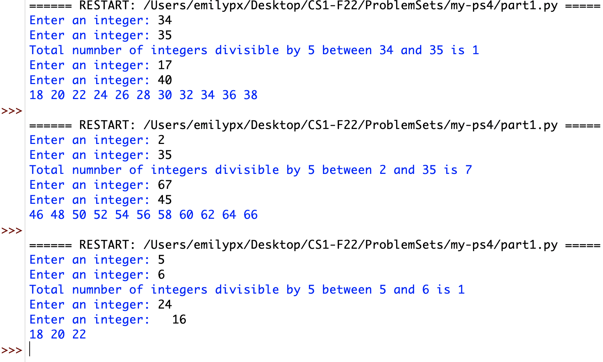
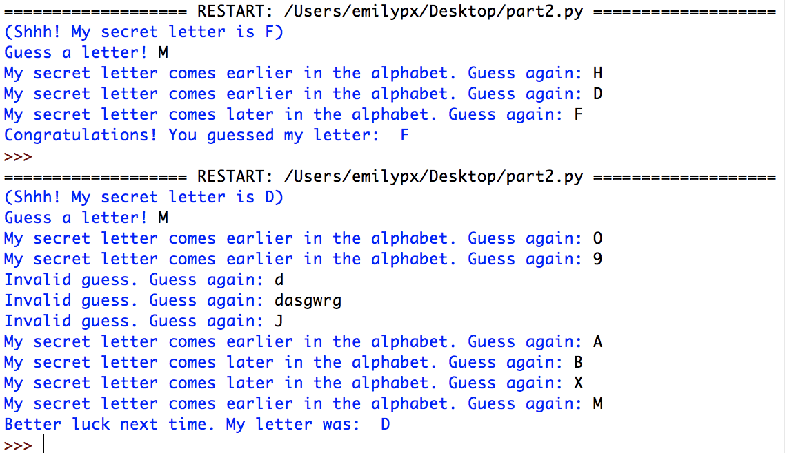
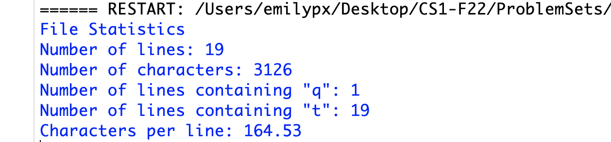

# Problem Set 4

### Due Monday, September 26, 2022, at 11:59pm EDT

For this problem set, you will submit to Canvas **a single .zip file**. Detailed instructions for what the .zip file should contain are at the end of this problem set. Note that if you do not submit the files as specified here, there will be a major deduction in your grade for this assignment. Following directions to the letter is a crucial skill for computer programming.

**Note: Your programs should all have the following format: import statements (if necessary); then function definitions (if there are any); then a `main()` function that gets the ball rolling and calls the functions you defined (if any); and finally outide all other functions, the call to `main()`.**

*Reminder:* I now expect you to write comments in your code! One point will be deducted if you do not provide comments explaining your code. Here's what I would like commented this time:

* Before every function, describe what it does and what its arguments are (if any).
* Before every variable, explain what value it is holding. (Exception: the variable that comes after `for`.)

And, as always, in every program, the first four lines (comments) should be:

* The name of the file.
* Your name.
* The date.
* A statement saying "This code is my own work. I did not share my code or look at the code of another student."

---

## Part 1: Fun with `for` loops
This week we learned about some more interesting things you can do with `range()` in a `for` loop. In this problem, you will write two functions that test your ability to use this functionality. You will create a file called `part1.py` which will contain the following functions:

1. `divisibleByFive(a, b)`: This function takes two integer arguments, `a` and `b`, and keeps track of the number of integers in between `a` and `b` **inclusive of both `a` and `b`** that are divisible by 5. First you'll initialize a variable to store this number. Then you'll have a `for` loop that goes through each integer between `a` and `b` and adds one to the storage variable for each integer that is divisible by 5. Then you will print out the value of that variable at the end of the function. *Hint: You will have to check to see which of `a` and `b` is bigger in order to set up your `for` loop properly. There are a few ways to do this!*

2. `everyEvenNumber(a, b)`: This function takes two integer arguments, `a` and `b`, and prints out every even number between `a` and `b` but **not including `a` or `b`** and **without including the modulus operator within the `for` loop code block**. The numbers must be printed out separated by a space rather than a new line. *Hint: Recall the `end=` option within `print()`.*

3. `main()`: The `main()` function will read in all input from the user for a total of four inputs (one for each argument of the two functions) and will call the above two function. 

Here are some example runs of the program:

## Part 2: Guess my letter
You will be starting this problem with the code provided in this repo called `part2.py`. You can download this repo by going to the green `Code` button and then clicking `Download .zip`, or if you have that Windows 11 problem with opening .zip files you can just copy and paste the code from `part2.py` into a file you have created in IDLE called `part2.py`.

The `main()` code I have provided will use a function I wrote to randomly select a secret letter between *A* and *Z*. Your job is to write code, within the `main()` function, that will allow the user **10 chances** to try to guess the letter. After each guess, the program will tell the user one of four things: 

1. The secret letter comes before the user's guess in the alphabet, and they should try again.

2. The secret letter comes after the user's guess in the alphabet, and they should try again.

3. The user entered an invalid option (i.e., something that is not a **capital letter in the standard American English A through Z alphabet**), and they should try again.

4. The user entered the correct letter. The secret letter will be revealed, the user will be congratulated, and the program will end.

If the user uses all 10 guesses without guessing the correct letter, print out a message revealing the secret letter and wishing them better luck next time.

**Note**
 * You will use a `while` loop to control the flow of interaction. 
 * You should use `<` and `>` to help with alphabetical order. 
 * **You may not use `break` or `return`. The `while` loop condition will be the only way to break out of the loop.** 
 * *You will need to think carefully about how to make sure you print out the correct message when the while loop ends!*
 
Here are some example runs of the program:

## Part 3: Working with input and output
Create a program called `part3.py`. It will have just a `main()` function. The `main()` function will:

1. Open a file to read provided as a command line argument. I've provided an example text file in this repository called `testfile.txt`.

2. Create **four** variables which will store, respectively: (1) the number of lines in the file; (2) the number of characters in the file; (3) the number of lines containing the letter "q"; (4) the number of lines containing the letter "t".

3. Read in the file line by line. For each line add to the totals stored in the above variables.

4. After reading in the file, open a file to write to called `filestats.txt`.

5. Write out to `filestats.txt` the information you kept track of while reading in the input file, as well as the average number of characters per line **formatted with two digits after the decimal point**, which you will 

Here is **EXACTLY** what the output file you create should look like:

---

## What to turn in
If you haven't already, create a `ps4` folder. In your `p4` folder you should have three python scripts: `part1.py`, `part2.py`, and `part3.py`. Remove any other things you might have accidentally put in the folder, then zip the folder up using whatever means you normally use to zip things up (e.g., on a Mac, you can right click and select `Compress`).

Upload the `.zip` file you created to Canvas. 

Note that if you do not submit the files as specified here, there will be a major deduction in your grade for this assignment. Following directions to the letter is a crucial skill for computer programming.

**Don't forget your comments!**

### This problem set is due Monday, September 26, 2022, at 11:59pm EDT
